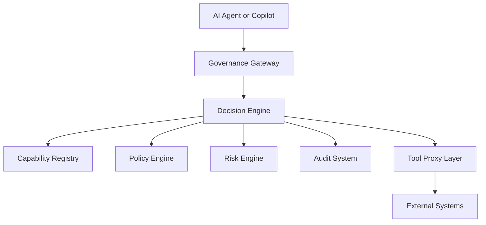
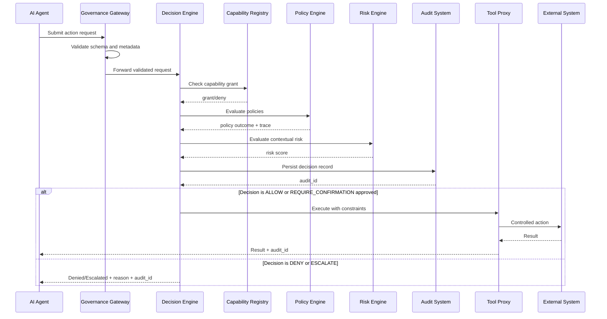

# RFC-0001

## AEGIS Governance Architecture

Version: 0.2  
Status: Draft  
Authors: AEGIS Project

---

## 1. Abstract

This document defines the reference architecture for AEGIS (Architectural
Enforcement and Governance of Intelligent Systems).

AEGIS introduces a deterministic governance control plane between AI-generated
intent and infrastructure execution. The architecture ensures that no action is
executed without explicit evaluation against capability, policy, authority, and
risk constraints.

---

## 2. Problem Statement

Model alignment and content moderation influence outputs but do not guarantee
control over operational side effects.

AEGIS addresses this gap by enforcing:

- complete mediation of action execution
- default-deny authorization
- deterministic decision logic
- immutable audit evidence

---

## 3. Architectural Principles

1. Deterministic Governance: same inputs and policy version produce same outcome.
2. Capability-First Authorization: every action maps to a predefined capability.
3. Explicit Authority Attribution: every request is bound to an authenticated actor.
4. Default Deny: absence of explicit authorization yields denial.
5. Complete Auditability: every decision is recorded and replay-verifiable.
6. Fail-Closed Safety: subsystem uncertainty cannot result in implicit allow.

---

## 4. System Context

---

## 5. Component Interaction Specification

### 5.1 Governance Gateway

Responsibilities:

- validate request schema and semantic constraints
- validate actor identity binding and request metadata
- reject malformed requests before decision evaluation
- route valid requests to Decision Engine

### 5.2 Decision Engine

Responsibilities:

- perform capability check
- evaluate policy precedence
- evaluate contextual risk thresholds
- produce one deterministic outcome

Outcomes:

- `ALLOW`
- `DENY`
- `ESCALATE`
- `REQUIRE_CONFIRMATION`

### 5.3 Capability Registry

Responsibilities:

- maintain canonical capability definitions
- maintain actor-capability grants
- support revocation and expiration semantics

### 5.4 Policy Engine

Responsibilities:

- evaluate policy conditions against request context
- apply deterministic precedence rules
- emit policy trace for auditability

### 5.5 Tool Proxy Layer

Responsibilities:

- execute only authorized decisions
- enforce runtime constraints
- prevent direct infrastructure bypass
- record execution telemetry

### 5.6 Audit System

Responsibilities:

- append immutable decision records
- support retrieval by request/actor/session
- provide evidence for replay and compliance

---

## 6. Request Lifecycle Sequence

---

## 7. Security Properties and Guarantees

### 7.1 Capability Isolation Guarantee

No request executes unless actor capability grant covers action and target.

### 7.2 Attribution Guarantee

Every decision and execution path includes actor, request ID, and timestamp.

### 7.3 Non-Bypass Guarantee

External execution interfaces are only reachable through Tool Proxy under a
valid governance decision.

### 7.4 Audit Integrity Guarantee

Every evaluated request produces an immutable audit record regardless of outcome.

### 7.5 Determinism Guarantee

Policy and risk evaluation are deterministic given identical inputs and versions.

---

## 8. Failure Mode Analysis

| Failure Mode | Expected Behavior | Security Posture |
|-------------|-------------------|------------------|
| Malformed request | Reject at Gateway | Fail closed |
| Capability registry unavailable | Deny/Escalate | Fail closed |
| Policy engine exception | Escalate or Deny | Fail closed |
| Audit persistence failure | Block execution for high-risk ops | Fail closed |
| Tool proxy unavailable | Deny execution path | Fail closed |
| External system timeout | Return controlled failure | No bypass |

---

## 9. Related Work

AEGIS builds on and extends concepts from:

- Reference Monitor model (Anderson, 1972)
- Security kernels and mandatory access control
- Policy-as-code systems (e.g., Open Policy Agent)
- Capability-based security models
- Zero-trust architecture patterns

AEGIS contribution is applying these controls to AI-proposed operational actions
with deterministic, auditable governance.

---

## 10. Relationship to Other Specifications

- RFC-0002: Governance Runtime API and deployment behavior
- RFC-0003: Capability Registry and Policy Language specification
- RFC-0004: Governance Event Model for federation and interoperability
- AGP-1: Governance protocol envelope and transport semantics

---

## 11. Conclusion

AEGIS architecture formalizes a control plane where intelligence may propose
actions, but only governance authorizes execution. This separation of reasoning
and execution is the core safety property enabling trustworthy AI operations.
