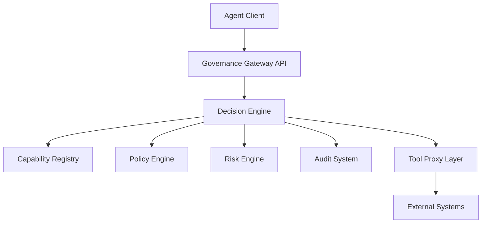
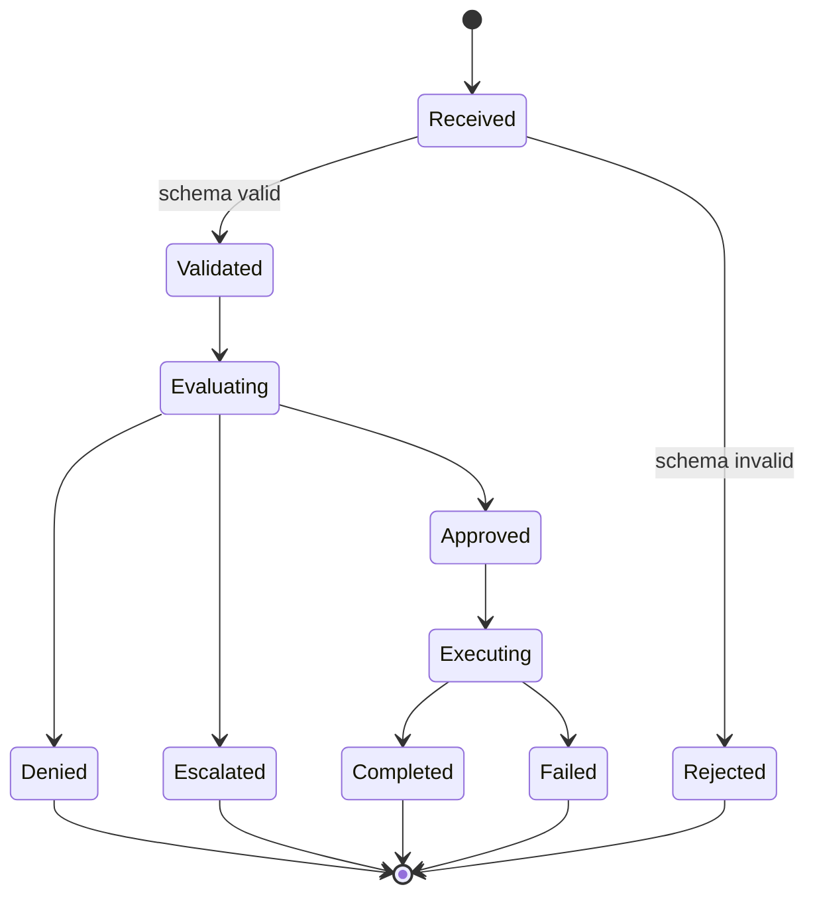
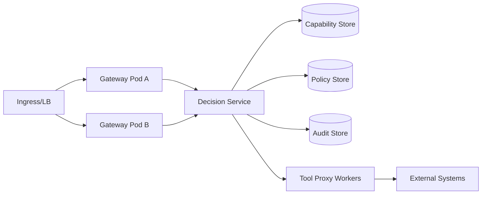

# RFC-0002

## AEGIS™ Governance Runtime Specification

**RFC**: RFC-0002  
**Version**: 0.2  
**Status**: Draft  
**Authors**: AEGIS™ Initiative  
**Created**: March 5, 2026  
**Last Updated**: March 6, 2026

---

# 1. Purpose

This document specifies the runtime APIs, state model, error behavior,
deployment topology, and performance expectations for the AEGIS™ Governance
Runtime.

---

# 2. Runtime Responsibilities

The runtime is responsible for:

- accepting action proposals from AI agents
- validating request schema and semantics
- evaluating capability, policy, and risk controls
- enforcing controlled execution via tool proxy
- emitting immutable audit evidence

---

# 3. Runtime Architecture



---

# 4. API Surface

## 4.1 Submit Action

Endpoint:

- `POST /aegis/actions`

Request schema:

```json
{
  "request_id": "uuid-v4",
  "actor_id": "agent:soc-001",
  "capability": "telemetry.query",
  "action_type": "tool_call",
  "target": "siem.search",
  "parameters": {
    "query": "failed_login > 10",
    "window": "15m"
  },
  "context": {
    "session_id": "sess-001",
    "environment": "production",
    "trace_id": "trace-abc",
    "timestamp": "2026-03-05T12:00:00Z"
  }
}
```

Response schema:

```json
{
  "request_id": "uuid-v4",
  "decision": "ALLOW",
  "reason": "Approved by policy 'soc_query_allow'",
  "audit_id": "audit-6f4f",
  "conditions": [
    "max_results=500",
    "timeout_ms=10000"
  ],
  "timestamp": "2026-03-05T12:00:00Z"
}
```

## 4.2 Retrieve Audit Record

Endpoint:

- `GET /aegis/audit/{audit_id}`

Response includes immutable decision and evaluation trace.

## 4.3 Health and Readiness

Endpoints:

- `GET /healthz`
- `GET /readyz`

Readiness fails if policy/capability/audit stores are unavailable.

---

# 5. Error Handling Specification

## 5.1 Error Envelope

```json
{
  "error_code": "INVALID_ACTION_TYPE",
  "message": "action_type must be one of [tool_call, file_read, ...]",
  "request_id": "uuid-v4",
  "retryable": false,
  "timestamp": "2026-03-05T12:00:01Z"
}
```

## 5.2 Standard Error Codes

| Code | HTTP | Retryable | Source |
|------|------|-----------|--------|
| INVALID_REQUEST | 400 | No | Gateway validation |
| INVALID_ACTION_TYPE | 400 | No | Gateway validation |
| UNAUTHORIZED_CAPABILITY | 403 | No | Capability check |
| POLICY_EVALUATION_ERROR | 500 | Maybe | Policy engine |
| AUDIT_PERSIST_ERROR | 503 | Yes | Audit system |
| UPSTREAM_TIMEOUT | 504 | Yes | Tool proxy |

## 5.3 Failure Behavior

- validation failures: reject immediately
- policy/capability uncertainty: fail closed
- audit write failure: block high-risk execution
- tool proxy timeout: return controlled error with audit record

---

# 6. Runtime State Model



---

# 7. Performance and Scalability Requirements

## 7.1 SLO Targets

- p50 decision latency <= 20 ms
- p95 decision latency <= 75 ms
- p99 decision latency <= 150 ms
- audit write success >= 99.99%

## 7.2 Throughput Targets

- single-node baseline: 500 evaluated actions/sec
- horizontal target: linear scaling to 10k actions/sec across cluster

## 7.3 Scalability Controls

- stateless gateway pods behind load balancer
- replicated policy/capability caches
- append-only audit store with partitioning
- bounded execution worker pools

---

# 8. Deployment Architecture



Deployment requirements:

- least-privilege service identities
- mTLS between runtime components
- isolated execution network for proxy workers
- immutable config snapshots per runtime version

---

# 9. Security and Recovery Requirements

- all decisions must be auditable
- no execution path may bypass gateway + decision engine
- runtime restart must not lose committed audit records
- degraded mode must fail closed

Recovery behavior:

- transient audit store outage: retry with bounded backoff
- persistent audit outage: deny high-risk requests and alert
- policy store unavailability: deny or escalate only

---

# 10. Reference Implementation Targets

- AI-assisted SOC operations
- cloud automation governance
- enterprise copilot runtime control
- regulated data access workflows

---

# 11. Relationship to Other Specifications

- RFC-0001: architecture and security guarantees
- RFC-0003: capability and policy semantics
- RFC-0004: governance event federation model
- AGP-1: transport and protocol envelope

---
